Factors Influencing Short Video Completion Rate: EDA
================
2025-11-24

``` r
library(tidyverse)
library(janitor)
library(scales)
library(patchwork)

# Define modern color palette
modern_colors <- c("#264653", "#2a9d8f", "#e9c46a", "#f4a261", "#e76f51", 
                   "#8ecae6", "#219ebc", "#023047", "#ffb703", "#fb8500")

theme_set(theme_minimal(base_size = 12))
```

``` r
df <- read_csv("./data/youtube_shorts_tiktok_trends_2025.csv") %>% 
  clean_names()
```

    ## Rows: 48079 Columns: 58
    ## ── Column specification ────────────────────────────────────────────────────
    ## Delimiter: ","
    ## chr  (28): platform, country, region, language, category, hashtag, title_key...
    ## dbl  (29): week_of_year, duration_sec, views, likes, comments, shares, saves...
    ## date  (1): publish_date_approx
    ## 
    ## ℹ Use `spec()` to retrieve the full column specification for this data.
    ## ℹ Specify the column types or set `show_col_types = FALSE` to quiet this message.

``` r
glimpse(df)
```

    ## Rows: 48,079
    ## Columns: 58
    ## $ platform                <chr> "TikTok", "TikTok", "TikTok", "TikTok", "TikTo…
    ## $ country                 <chr> "Jp", "Se", "Za", "Kr", "Au", "Ke", "Us", "Us"…
    ## $ region                  <chr> "Asia", "Europe", "Africa", "Asia", "Oceania",…
    ## $ language                <chr> "ja", "sv", "en", "ko", "en", "sw", "en", "en"…
    ## $ category                <chr> "Gaming", "Food", "Art", "News", "Beauty", "Ar…
    ## $ hashtag                 <chr> "#Lifestyle", "#Sports", "#Workout", "#Esports…
    ## $ title_keywords          <chr> "Night Routine — College", "Morning Routine — …
    ## $ author_handle           <chr> "NextVision", "DailyVlogsDiego", "BeyondHub", …
    ## $ sound_type              <chr> "trending", "trending", "licensed", "original"…
    ## $ music_track             <chr> "8bit loop", "Street vibe", "Gallery pad", "Ne…
    ## $ week_of_year            <dbl> 1, 1, 1, 1, 1, 1, 1, 1, 1, 1, 1, 1, 1, 1, 1, 1…
    ## $ duration_sec            <dbl> 40, 18, 22, 36, 35, 33, 26, 18, 31, 34, 36, 13…
    ## $ views                   <dbl> 252497, 270580, 7385, 72377, 16174, 47449, 270…
    ## $ likes                   <dbl> 21755, 23080, 363, 6243, 832, 2462, 1868, 8917…
    ## $ comments                <dbl> 3170, 2124, 33, 811, 68, 254, 257, 1084, 584, …
    ## $ shares                  <dbl> 1977, 2108, 38, 383, 67, 245, 218, 562, 556, 4…
    ## $ saves                   <dbl> 3415, 3265, 69, 391, 204, 155, 306, 556, 559, …
    ## $ engagement_rate         <dbl> 0.120069, 0.113005, 0.068111, 0.108156, 0.0724…
    ## $ trend_label             <chr> "rising", "declining", "seasonal", "declining"…
    ## $ source_hint             <chr> "TikTok Creative Center", "TikTok Creative Cen…
    ## $ notes                   <chr> "split-screen", "greenscreen", "subtitles", "c…
    ## $ device_type             <chr> "Android", "Android", "Android", "Android", "A…
    ## $ upload_hour             <dbl> 15, 3, 15, 15, 18, 18, 21, 23, 18, 18, 15, 17,…
    ## $ genre                   <chr> "Lifestyle", "Sports", "Sports", "Gaming", "Co…
    ## $ trend_duration_days     <dbl> 4, 56, 11, 10, 6, 12, 19, 7, 17, 3, 4, 5, 6, 6…
    ## $ trend_type              <chr> "Short", "Evergreen", "Medium", "Medium", "Sho…
    ## $ engagement_velocity     <dbl> 63124.25, 4831.79, 671.36, 7237.70, 2695.67, 3…
    ## $ dislikes                <dbl> 1011, 655, 12, 229, 19, 83, 51, 64, 58, 201, 4…
    ## $ comment_ratio           <dbl> 0.012555, 0.007850, 0.004469, 0.011205, 0.0042…
    ## $ share_rate              <dbl> 0.007830, 0.007791, 0.005146, 0.005292, 0.0041…
    ## $ save_rate               <dbl> 0.013525, 0.012067, 0.009343, 0.005402, 0.0126…
    ## $ like_dislike_ratio      <dbl> 21.49704, 35.18293, 27.92308, 27.14348, 41.600…
    ## $ publish_dayofweek       <chr> "Saturday", "Wednesday", "Sunday", "Friday", "…
    ## $ publish_period          <chr> "Afternoon", "Night", "Afternoon", "Afternoon"…
    ## $ event_season            <chr> "Regular", "Regular", "Regular", "SummerBreak"…
    ## $ tags                    <chr> "daily, lifestyle, motivation", "gym, football…
    ## $ sample_comments         <chr> "ずっと見ちゃう😂", "This is fire 🔥", "Instant like!",…
    ## $ creator_avg_views       <dbl> 96474.3, 104638.4, 108139.9, 102133.2, 87549.4…
    ## $ creator_tier            <chr> "Mid", "Mid", "Mid", "Mid", "Mid", "Mid", "Mid…
    ## $ season                  <chr> "Spring", "Fall", "Fall", "Summer", "Fall", "F…
    ## $ publish_date_approx     <date> 2025-01-04, 2025-01-01, 2025-01-05, 2025-01-0…
    ## $ year_month              <chr> "2025-01", "2025-01", "2025-01", "2025-01", "2…
    ## $ title                   <chr> "Night Routine — Productivity 🏖️", "Football sk…
    ## $ title_length            <dbl> 31, 24, 22, 30, 13, 23, 22, 17, 17, 22, 21, 22…
    ## $ has_emoji               <dbl> 1, 1, 0, 1, 1, 1, 1, 1, 0, 1, 1, 0, 0, 1, 0, 1…
    ## $ avg_watch_time_sec      <dbl> 25.8, 10.4, 11.7, 23.7, 24.6, 18.1, 20.2, 13.1…
    ## $ completion_rate         <dbl> 0.645, 0.578, 0.532, 0.658, 0.703, 0.548, 0.77…
    ## $ device_brand            <chr> "iPhone", "iPhone", "Huawei", "Huawei", "Huawe…
    ## $ traffic_source          <chr> "External", "Search", "External", "Search", "F…
    ## $ is_weekend              <dbl> 1, 0, 1, 1, 1, 1, 1, 1, 1, 1, 1, 1, 1, 1, 1, 1…
    ## $ row_id                  <chr> "2e681528d17a1fe1986857942536ec27", "2e35fa0b2…
    ## $ engagement_total        <dbl> 30317, 30577, 503, 7828, 1171, 3116, 2649, 111…
    ## $ like_rate               <dbl> 0.086159, 0.085298, 0.049154, 0.086257, 0.0514…
    ## $ dislike_rate            <dbl> 0.004004, 0.002421, 0.001625, 0.003164, 0.0011…
    ## $ engagement_per_1k       <dbl> 120.069, 113.005, 68.111, 108.156, 72.400, 65.…
    ## $ engagement_like_rate    <dbl> 0.08615944, 0.08529825, 0.04915369, 0.08625668…
    ## $ engagement_comment_rate <dbl> 0.012554605, 0.007849804, 0.004468517, 0.01120…
    ## $ engagement_share_rate   <dbl> 0.007829796, 0.007790672, 0.005145565, 0.00529…

``` r
missing_summary <- df %>%
  summarise(across(everything(), ~sum(is.na(.)))) %>%
  pivot_longer(everything(), names_to = "variable", values_to = "missing_count") %>%
  filter(missing_count > 0) %>%
  mutate(missing_pct = missing_count / nrow(df) * 100) %>%
  arrange(desc(missing_count))

print(missing_summary)
```

    ## # A tibble: 0 × 3
    ## # ℹ 3 variables: variable <chr>, missing_count <int>, missing_pct <dbl>

``` r
metrics_summary <- df %>%
  summarise(
    total_videos = n(),
    total_views = sum(views, na.rm = TRUE),
    avg_views = mean(views, na.rm = TRUE),
    median_views = median(views, na.rm = TRUE),
    avg_engagement = mean(engagement_rate, na.rm = TRUE),
    median_engagement = median(engagement_rate, na.rm = TRUE),
    avg_completion = mean(completion_rate, na.rm = TRUE),
    median_completion = median(completion_rate, na.rm = TRUE),
    avg_duration = mean(duration_sec, na.rm = TRUE),
    median_duration = median(duration_sec, na.rm = TRUE)
  )

print(metrics_summary)
```

    ## # A tibble: 1 × 10
    ##   total_videos total_views avg_views median_views avg_engagement
    ##          <int>       <dbl>     <dbl>        <dbl>          <dbl>
    ## 1        48079  4773896651    99293.        59620         0.0754
    ## # ℹ 5 more variables: median_engagement <dbl>, avg_completion <dbl>,
    ## #   median_completion <dbl>, avg_duration <dbl>, median_duration <dbl>

## 1. Distribution of Key Metrics

``` r
completion_dist_plot <- ggplot(df, aes(x = completion_rate)) +
  geom_density(fill = modern_colors[1], alpha = 0.6, color = modern_colors[1]) +
  geom_vline(xintercept = median(df$completion_rate, na.rm = TRUE), 
             linetype = "dashed", color = modern_colors[5], size = 1) +
  labs(title = "Distribution of Completion Rate",
       x = "Completion Rate",
       y = "Density") +
  theme_minimal()

completion_dist_plot
```

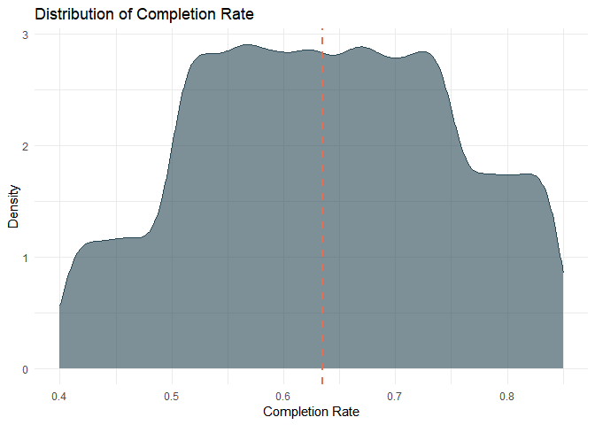<!-- -->

``` r
engagement_dist_plot <- ggplot(df, aes(x = engagement_rate)) +
  geom_density(fill = modern_colors[2], alpha = 0.6, color = modern_colors[2]) +
  geom_vline(xintercept = median(df$engagement_rate, na.rm = TRUE), 
             linetype = "dashed", color = modern_colors[5], size = 1) +
  labs(title = "Distribution of Engagement Rate",
       x = "Engagement Rate",
       y = "Density") +
  theme_minimal()

engagement_dist_plot
```

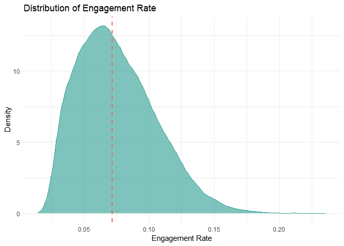<!-- -->

``` r
metrics_boxplot <- df %>%
  select(engagement_rate, completion_rate) %>%
  pivot_longer(everything(), names_to = "metric", values_to = "value") %>%
  mutate(metric = recode(metric, 
                         engagement_rate = "Engagement Rate",
                         completion_rate = "Completion Rate")) %>%
  ggplot(aes(x = metric, y = value, fill = metric)) +
  geom_boxplot(alpha = 0.7) +
  scale_fill_manual(values = c("Engagement Rate" = modern_colors[2], 
                                "Completion Rate" = modern_colors[1])) +
  labs(title = "Distribution of Engagement and Completion Rates",
       x = "",
       y = "Rate") +
  theme_minimal() +
  theme(legend.position = "none")

metrics_boxplot
```

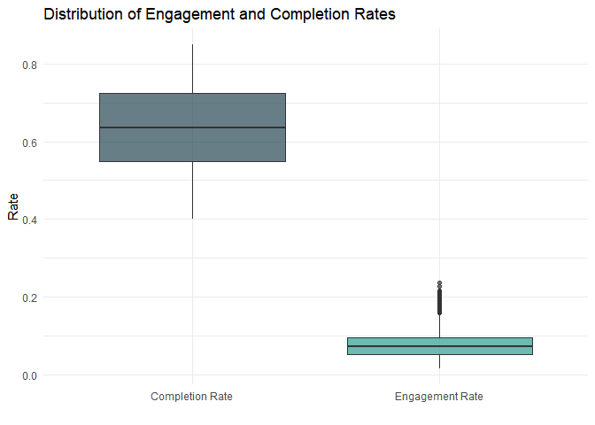<!-- -->

``` r
engagement_completion_plot <- ggplot(df, aes(x = completion_rate, y = engagement_rate)) +
  geom_point(alpha = 0.3, color = modern_colors[1]) +
  geom_smooth(method = "lm", color = modern_colors[2], se = TRUE, size = 1) +
  labs(title = "Engagement Rate vs Completion Rate",
       x = "Completion Rate",
       y = "Engagement Rate") +
  theme_minimal()

engagement_completion_plot
```

    ## `geom_smooth()` using formula = 'y ~ x'

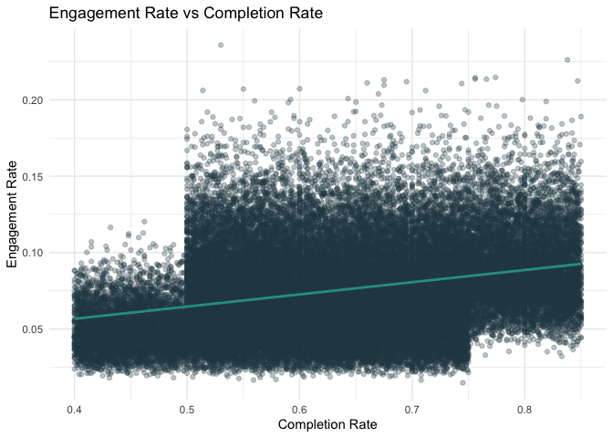<!-- -->

## 2. Temporal Patterns: Upload Timing

``` r
hour_analysis_data <- df %>%
  group_by(upload_hour) %>%
  summarise(
    video_count = n(),
    avg_completion = mean(completion_rate, na.rm = TRUE),
    avg_engagement = mean(engagement_rate, na.rm = TRUE),
    .groups = "drop"
  ) %>%
  arrange(upload_hour)

p1 <- ggplot(hour_analysis_data, aes(x = upload_hour, y = video_count)) +
  geom_bar(stat = "identity", fill = modern_colors[3], alpha = 0.7) +
  scale_x_continuous(breaks = seq(0, 23, 2)) +
  labs(title = "Video Count by Upload Hour",
       x = "Upload Hour (24h format)",
       y = "Video Count") +
  theme_minimal()

p2 <- ggplot(hour_analysis_data, aes(x = upload_hour, y = avg_completion)) +
  geom_line(color = modern_colors[4], size = 1.2) +
  geom_point(color = modern_colors[4], size = 3) +
  scale_x_continuous(breaks = seq(0, 23, 2)) +
  labs(title = "Avg Completion Rate by Upload Hour",
       x = "Upload Hour (24h format)",
       y = "Average Completion Rate") +
  theme_minimal()

p3 <- ggplot(hour_analysis_data, aes(x = upload_hour, y = avg_engagement)) +
  geom_line(color = modern_colors[5], size = 1.2) +
  geom_point(color = modern_colors[5], size = 3) +
  scale_x_continuous(breaks = seq(0, 23, 2)) +
  labs(title = "Avg Engagement Rate by Upload Hour",
       x = "Upload Hour (24h format)",
       y = "Average Engagement Rate") +
  theme_minimal()

# Combine plots
hour_analysis_combined <- p1 / (p2 | p3)
hour_analysis_combined
```

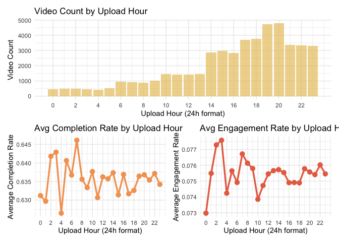<!-- -->

``` r
weekend_data <- df %>%
  mutate(day_type = ifelse(is_weekend == 1, "Weekend", "Weekday")) %>%
  count(day_type)

weekend_plot <- ggplot(weekend_data, aes(x = day_type, y = n, fill = day_type)) +
  geom_bar(stat = "identity", alpha = 0.8) +
  geom_text(aes(label = comma(n)), vjust = -0.5, size = 5) +
  scale_fill_manual(values = c("Weekday" = modern_colors[4], "Weekend" = modern_colors[5])) +
  labs(title = "Upload Distribution: Weekday vs Weekend",
       x = "Day Type",
       y = "Video Count") +
  theme_minimal() +
  theme(legend.position = "none")

weekend_plot
```

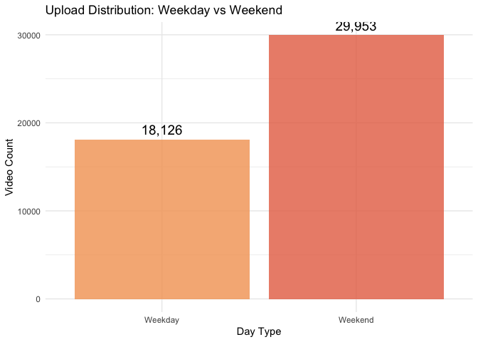<!-- -->

``` r
weekend_performance_data <- df %>%
  mutate(day_type = ifelse(is_weekend == 1, "Weekend", "Weekday")) %>%
  group_by(day_type) %>%
  summarise(
    video_count = n(),
    avg_completion = mean(completion_rate, na.rm = TRUE),
    avg_engagement = mean(engagement_rate, na.rm = TRUE),
    .groups = "drop"
  )

p_completion <- ggplot(weekend_performance_data, aes(x = day_type, y = avg_completion, fill = day_type)) +
  geom_bar(stat = "identity", alpha = 0.8) +
  geom_text(aes(label = round(avg_completion, 4)), vjust = -0.5, size = 4) +
  scale_fill_manual(values = c("Weekday" = modern_colors[4], "Weekend" = modern_colors[5])) +
  labs(title = "Completion Rate",
       x = "Day Type",
       y = "Average Completion Rate") +
  theme_minimal() +
  theme(legend.position = "none")

p_engagement <- ggplot(weekend_performance_data, aes(x = day_type, y = avg_engagement, fill = day_type)) +
  geom_bar(stat = "identity", alpha = 0.8) +
  geom_text(aes(label = round(avg_engagement, 4)), vjust = -0.5, size = 4) +
  scale_fill_manual(values = c("Weekday" = modern_colors[4], "Weekend" = modern_colors[5])) +
  labs(title = "Engagement Rate",
       x = "Day Type",
       y = "Average Engagement Rate") +
  theme_minimal() +
  theme(legend.position = "none")

weekend_performance_plot <- p_completion | p_engagement
weekend_performance_plot
```

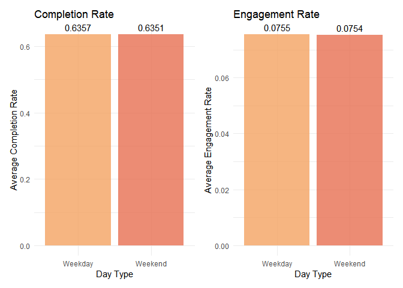<!-- -->

## 3. Content Characteristics: Duration and Title

``` r
duration_plot <- ggplot(df, aes(x = duration_sec)) +
  geom_histogram(bins = 50, fill = modern_colors[6], alpha = 0.7, color = "black") +
  labs(title = "Distribution of Video Duration",
       x = "Duration (seconds)",
       y = "Video Count") +
  theme_minimal()

duration_plot
```

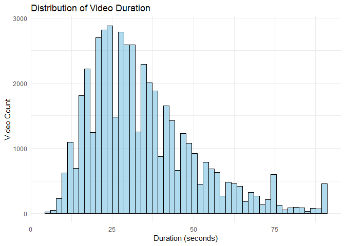<!-- -->

``` r
title_length_plot <- ggplot(df, aes(x = title_length)) +
  geom_histogram(bins = 50, fill = modern_colors[7], alpha = 0.7, color = "black") +
  labs(title = "Distribution of Title Length",
       x = "Title Length (characters)",
       y = "Video Count") +
  theme_minimal()

title_length_plot
```

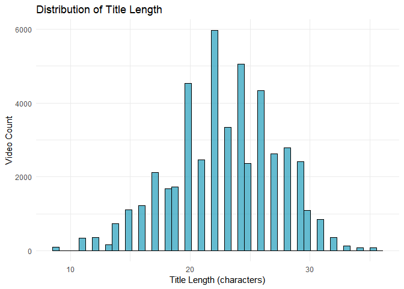<!-- -->

``` r
title_completion_data <- df %>%
  mutate(title_bin = cut(title_length, 
                         breaks = seq(0, max(title_length, na.rm = TRUE) + 10, by = 10),
                         include.lowest = TRUE)) %>%
  group_by(title_bin) %>%
  summarise(
    video_count = n(),
    avg_completion = mean(completion_rate, na.rm = TRUE),
    avg_engagement = mean(engagement_rate, na.rm = TRUE),
    .groups = "drop"
  ) %>%
  filter(video_count >= 5)

title_completion_plot <- ggplot(title_completion_data, aes(x = title_bin, y = avg_completion)) +
  geom_bar(stat = "identity", fill = modern_colors[7], alpha = 0.5) +
  labs(title = "Average Completion Rate by Title Length",
       x = "Title Length (characters)",
       y = "Average Completion Rate") +
  theme_minimal() +
  theme(axis.text.x = element_text(angle = 45, hjust = 1))

title_completion_plot
```

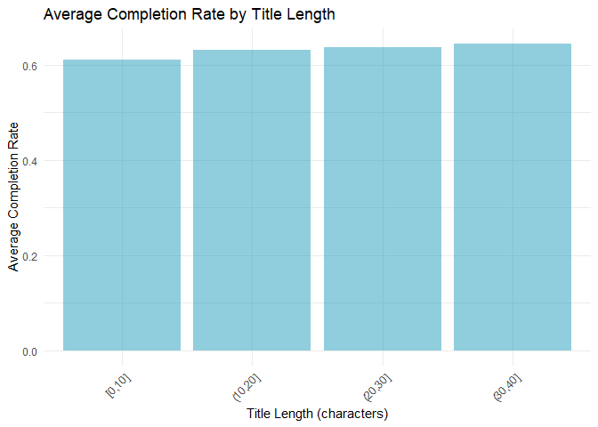<!-- -->

``` r
emoji_performance_data <- df %>%
  mutate(emoji_usage = ifelse(has_emoji == 1, "With Emoji", "Without Emoji")) %>%
  group_by(emoji_usage) %>%
  summarise(
    video_count = n(),
    avg_completion = mean(completion_rate, na.rm = TRUE),
    avg_engagement = mean(engagement_rate, na.rm = TRUE),
    .groups = "drop"
  )

print(emoji_performance_data)
```

    ## # A tibble: 2 × 4
    ##   emoji_usage   video_count avg_completion avg_engagement
    ##   <chr>               <int>          <dbl>          <dbl>
    ## 1 With Emoji          22135          0.650         0.0815
    ## 2 Without Emoji       25944          0.623         0.0702

``` r
p_emoji_completion <- ggplot(emoji_performance_data, aes(x = emoji_usage, y = avg_completion, fill = emoji_usage)) +
  geom_bar(stat = "identity", alpha = 0.8) +
  geom_text(aes(label = round(avg_completion, 4)), vjust = -0.5, size = 4) +
  scale_fill_manual(values = c("With Emoji" = modern_colors[3], 
                                "Without Emoji" = modern_colors[6])) +
  labs(title = "Completion Rate",
       x = "Emoji Usage",
       y = "Average Completion Rate") +
  theme_minimal() +
  theme(legend.position = "none")

p_emoji_engagement <- ggplot(emoji_performance_data, aes(x = emoji_usage, y = avg_engagement, fill = emoji_usage)) +
  geom_bar(stat = "identity", alpha = 0.8) +
  geom_text(aes(label = round(avg_engagement, 4)), vjust = -0.5, size = 4) +
  scale_fill_manual(values = c("With Emoji" = modern_colors[3], 
                                "Without Emoji" = modern_colors[6])) +
  labs(title = "Engagement Rate",
       x = "Emoji Usage",
       y = "Average Engagement Rate") +
  theme_minimal() +
  theme(legend.position = "none")

emoji_comparison_plot <- p_emoji_completion | p_emoji_engagement
emoji_comparison_plot
```

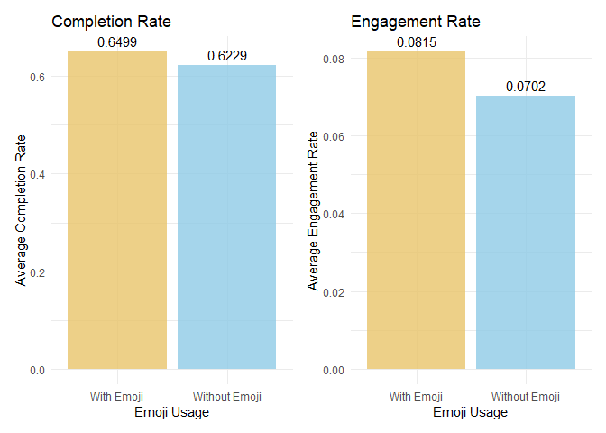<!-- -->

``` r
emoji_boxplot <- df %>%
  mutate(emoji_usage = ifelse(has_emoji == 1, "With Emoji", "Without Emoji")) %>%
  select(emoji_usage, completion_rate, engagement_rate) %>%
  pivot_longer(cols = c(completion_rate, engagement_rate),
               names_to = "metric",
               values_to = "value") %>%
  mutate(metric = recode(metric,
                         completion_rate = "Completion Rate",
                         engagement_rate = "Engagement Rate")) %>%
  ggplot(aes(x = emoji_usage, y = value, fill = emoji_usage)) +
  geom_boxplot(alpha = 0.7) +
  facet_wrap(~metric, scales = "free_y") +
  scale_fill_manual(values = c("With Emoji" = modern_colors[3], 
                                "Without Emoji" = modern_colors[6])) +
  labs(title = "Distribution of Metrics by Emoji Usage",
       x = "Emoji Usage",
       y = "Rate") +
  theme_minimal() +
  theme(legend.position = "none")

emoji_boxplot
```

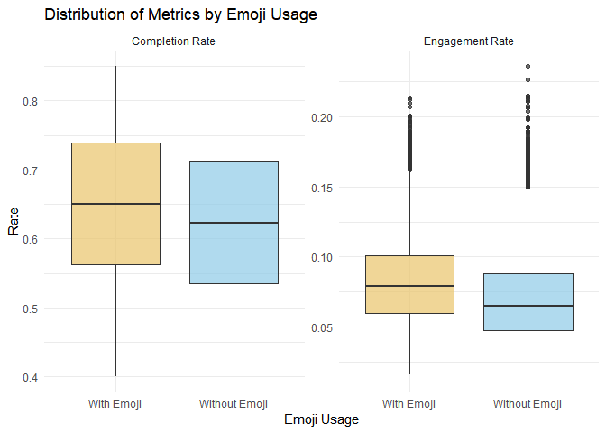<!-- -->

## 4. Content Type and Category

``` r
category_data <- df %>%
  count(category) %>%
  arrange(desc(n)) %>%
  head(15) %>%
  mutate(percentage = n / sum(n) * 100,
         label = paste0(category, "\n", round(percentage, 1), "%"))

category_plot <- ggplot(category_data, aes(x = "", y = n, fill = category)) +
  geom_bar(stat = "identity", width = 1) +
  coord_polar("y", start = 0) +
  geom_text(aes(label = round(percentage, 1)), 
            position = position_stack(vjust = 0.5),
            size = 3.5, color = "white", fontface = "bold") +
  scale_fill_manual(values = rep(modern_colors, length.out = 15)) +
  labs(title = "Top 15 Video Categories Distribution",
       fill = "Category") +
  theme_void() +
  theme(plot.title = element_text(hjust = 0.5, size = 14, face = "bold"),
        legend.position = "right")

category_plot
```

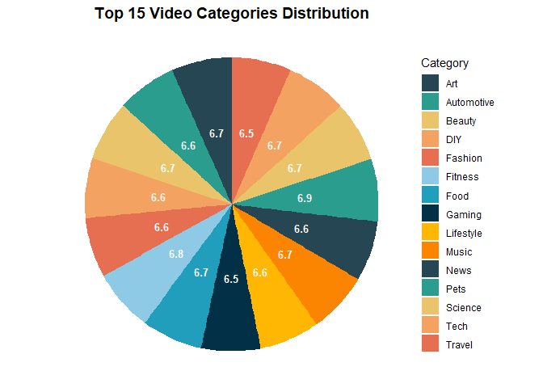<!-- -->

``` r
hashtag_data <- df %>%
  group_by(hashtag) %>%
  summarise(
    video_count = n(),
    total_views = sum(views, na.rm = TRUE),
    .groups = "drop"
  ) %>%
  arrange(desc(total_views)) %>%
  head(20)

hashtag_plot <- ggplot(hashtag_data, aes(x = reorder(hashtag, total_views), y = total_views)) +
  geom_bar(stat = "identity", fill = modern_colors[8], alpha = 0.8) +
  coord_flip() +
  scale_y_continuous(labels = comma) +
  labs(title = "Top 20 Hashtags by Total Views",
       x = "Hashtag",
       y = "Total Views") +
  theme_minimal()

hashtag_plot
```

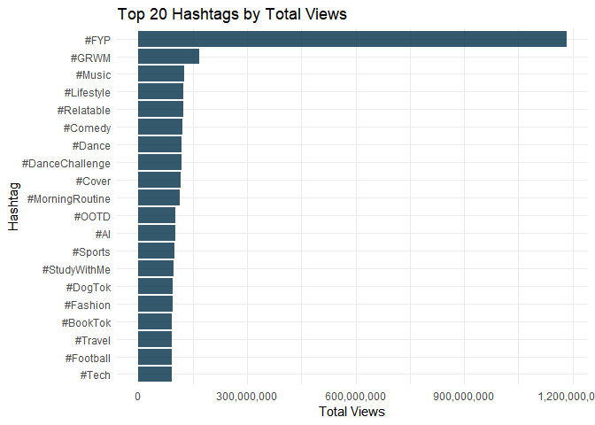<!-- -->

## 5. Creator Analysis

``` r
creator_views_plot <- ggplot(df, aes(x = creator_avg_views, y = views)) +
  geom_point(alpha = 0.05, color = modern_colors[8]) +
  geom_smooth(method = "lm", color = modern_colors[9], se = TRUE, size = 1) +
  scale_x_log10(labels = comma) +
  scale_y_log10(labels = comma) +
  labs(title = "Creator Average Views vs Video Views",
       x = "Creator Average Views (Log Scale)",
       y = "Video Views (Log Scale)") +
  theme_minimal()

creator_views_plot
```

    ## `geom_smooth()` using formula = 'y ~ x'

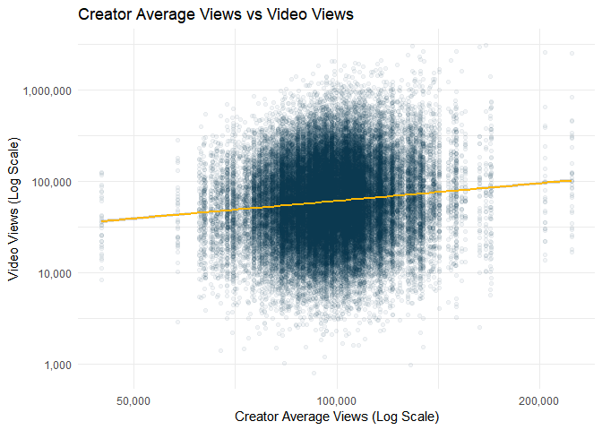<!-- -->

## 6. Platform Comparison

``` r
platform_data <- df %>%
  group_by(platform) %>%
  summarise(
    video_count = n(),
    avg_completion = mean(completion_rate, na.rm = TRUE),
    avg_engagement = mean(engagement_rate, na.rm = TRUE),
    avg_views = mean(views, na.rm = TRUE),
    total_views = sum(views, na.rm = TRUE),
    .groups = "drop"
  ) %>%
  arrange(desc(avg_completion))

print(platform_data)
```

    ## # A tibble: 2 × 6
    ##   platform video_count avg_completion avg_engagement avg_views total_views
    ##   <chr>          <int>          <dbl>          <dbl>     <dbl>       <dbl>
    ## 1 TikTok         28844          0.676         0.0918    99800.  2878625796
    ## 2 YouTube        19235          0.574         0.0509    98532.  1895270855

``` r
p_platform_completion <- ggplot(platform_data, aes(x = platform, y = avg_completion, fill = platform)) +
  geom_bar(stat = "identity", alpha = 0.8) +
  geom_text(aes(label = round(avg_completion, 4)), vjust = -0.5, size = 4) +
  scale_fill_manual(values = c("TikTok" = modern_colors[1], 
                                "YouTube Shorts" = modern_colors[2])) +
  labs(title = "Completion Rate",
       x = "Platform",
       y = "Average Completion Rate") +
  theme_minimal() +
  theme(legend.position = "none")

p_platform_engagement <- ggplot(platform_data, aes(x = platform, y = avg_engagement, fill = platform)) +
  geom_bar(stat = "identity", alpha = 0.8) +
  geom_text(aes(label = round(avg_engagement, 4)), vjust = -0.5, size = 4) +
  scale_fill_manual(values = c("TikTok" = modern_colors[1], 
                                "YouTube Shorts" = modern_colors[2])) +
  labs(title = "Engagement Rate",
       x = "Platform",
       y = "Average Engagement Rate") +
  theme_minimal() +
  theme(legend.position = "none")

platform_plot <- p_platform_completion | p_platform_engagement
platform_plot
```

<!-- -->

``` r
platform_boxplot <- df %>%
  select(platform, completion_rate, engagement_rate) %>%
  pivot_longer(cols = c(completion_rate, engagement_rate),
               names_to = "metric",
               values_to = "value") %>%
  mutate(metric = recode(metric,
                         completion_rate = "Completion Rate",
                         engagement_rate = "Engagement Rate")) %>%
  ggplot(aes(x = platform, y = value, fill = platform)) +
  geom_boxplot(alpha = 0.7) +
  facet_wrap(~metric, scales = "free_y") +
  scale_fill_manual(values = c("TikTok" = modern_colors[1], 
                                "YouTube Shorts" = modern_colors[2])) +
  labs(title = "Distribution of Metrics by Platform",
       x = "Platform",
       y = "Rate") +
  theme_minimal() +
  theme(legend.position = "none")

platform_boxplot
```

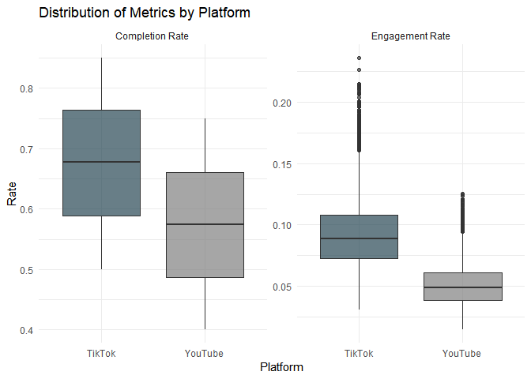<!-- -->
